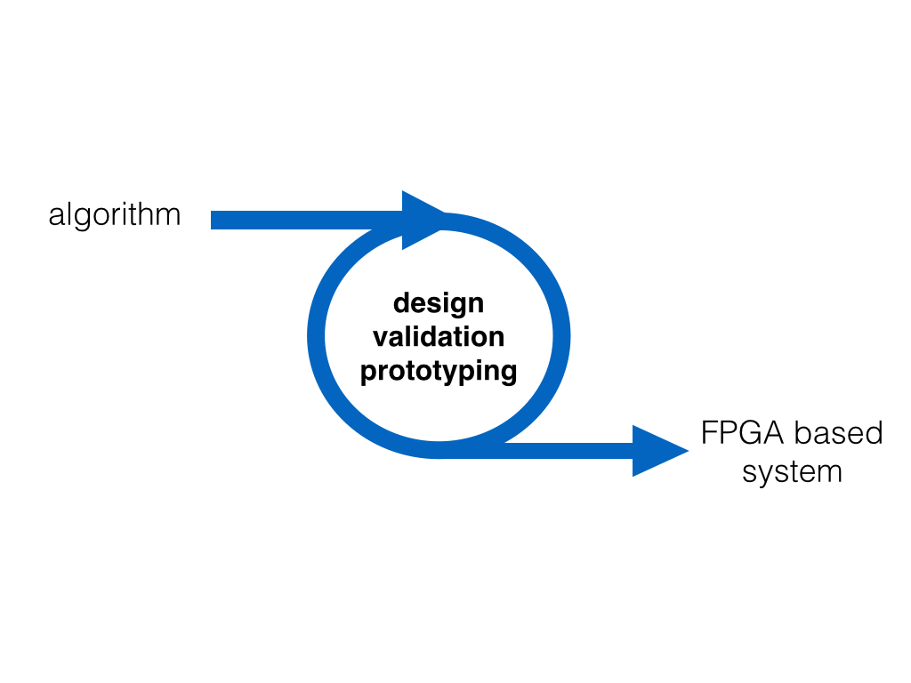
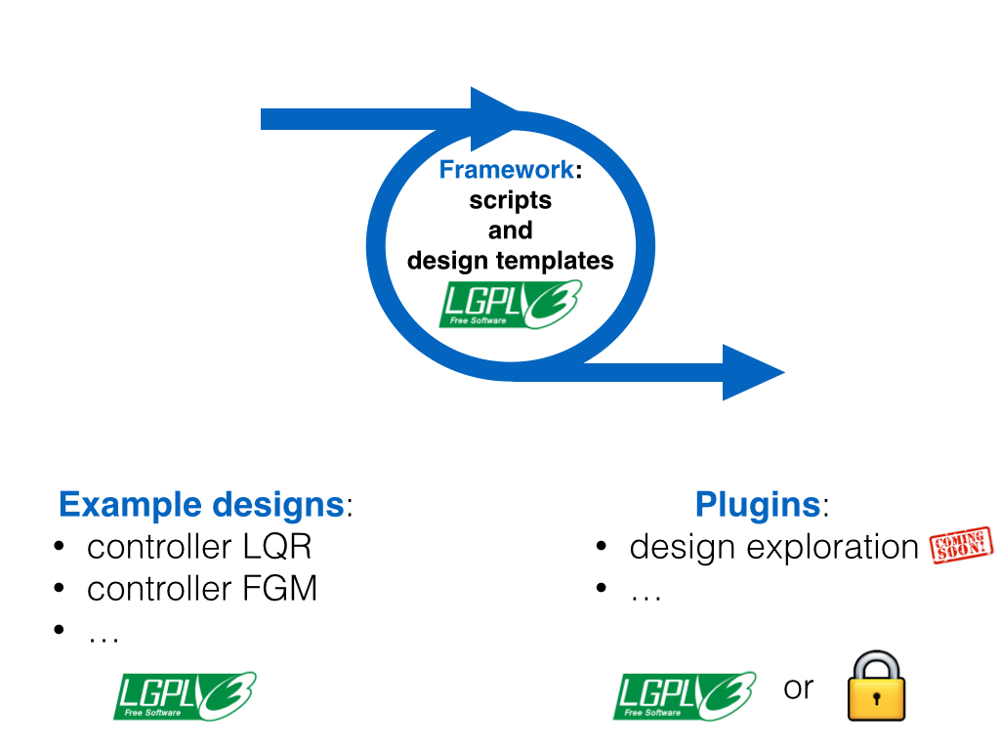
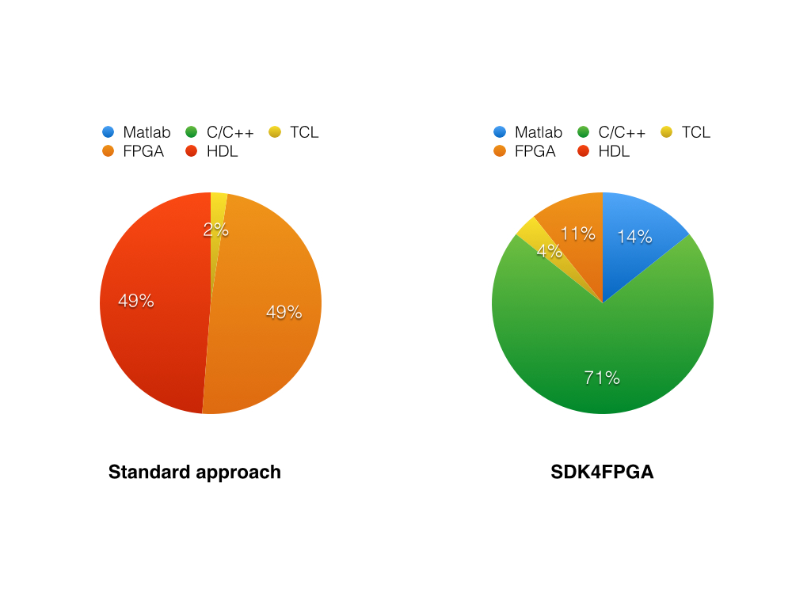
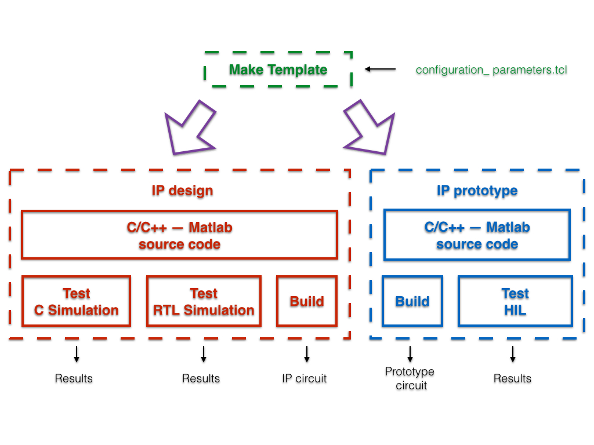
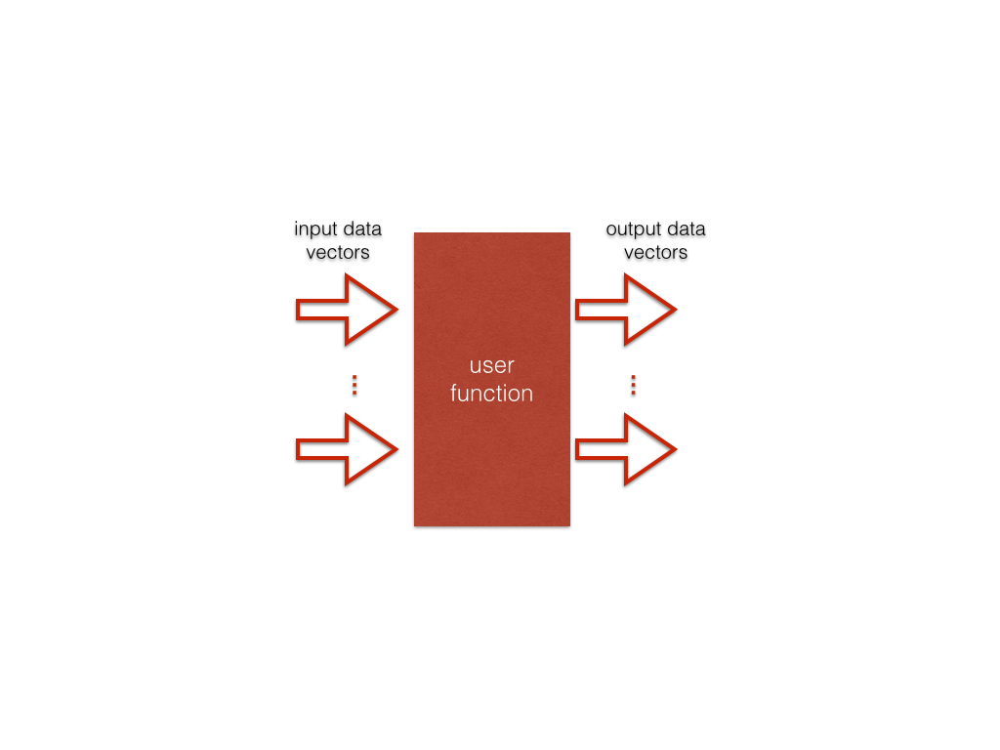
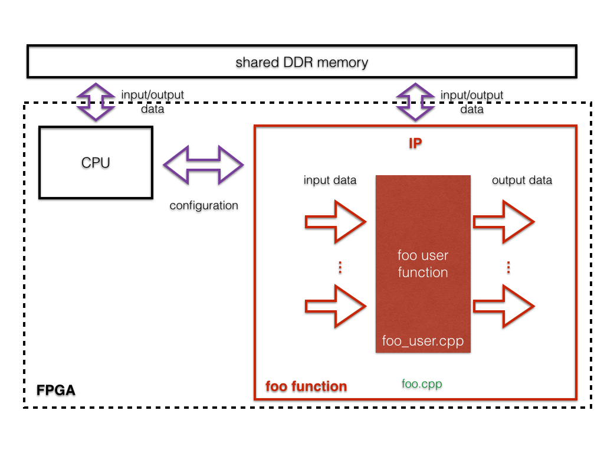
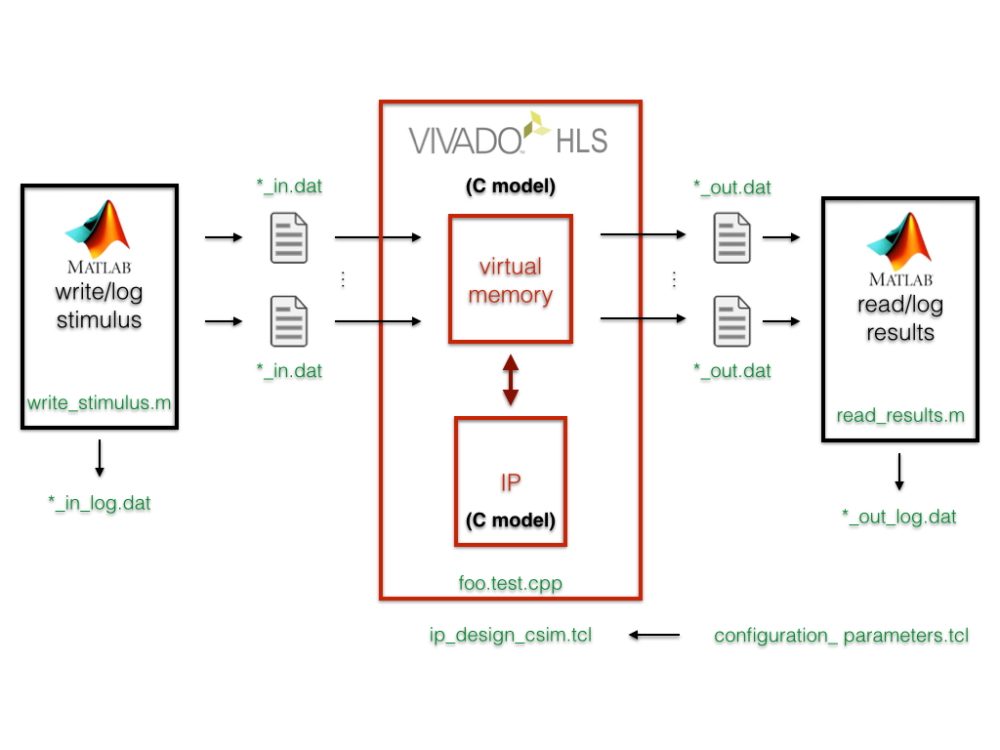
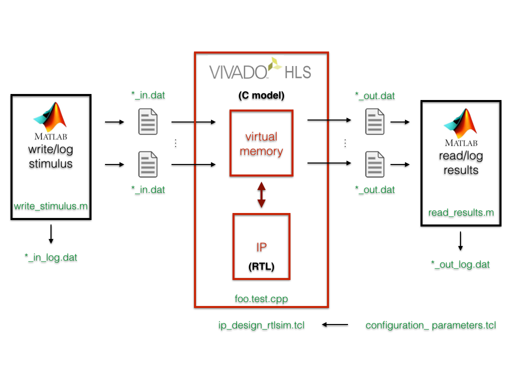
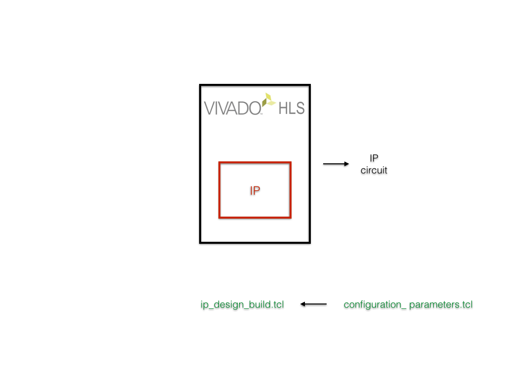
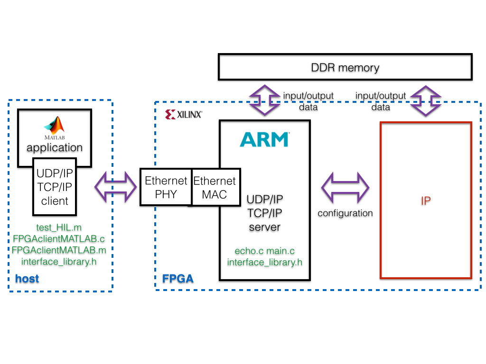

#ICL SDK4FPGA

Copyright (C) 2014 by Andrea Suardi <a.suardi@imperial.ac.uk> , Imperial College London.  
Supported by the EPSRC Impact Acceleration grant number EP/K503733/1 

---

### Why it ?

* ICL SDK4FPGA **enables** researchers and engineers (**with or without FPGA knowhow**) to **build, validate and prototype** mathematical algorithms for **FPGA** based system.
* Users **only** need to **code algorithm** using **C/C++** programming languages.
* **Abstracts low level** FPGA **details** from the users: build a testbench, data access to external FPGA memory or host system ...
* Gives **full control (NOT a black box)** of all project phases (test, build, prototype)

---
### Ecosystem

ICL SDK4FPGA is open source under [GNU Lesser General Public License v3](LICENSE) consisting of:

* **Framework:** TCL scripts and customized design templates (C/C++ and Matlab code) that support the users during in all the project phases.
* **Plugins:** advance features that support the users to enhance their FPGA design productivity. As example, FPGA circuit architecture auto tuning to enable utilization of low power and low cost embedded devices devices preserving algorithm numerical performance.  
* **Example designs:** users application designs built with ICL SDK4FPGA framework. 

---

### What do I need to set up an algorithm running in FPGA ?

##### Expertise

Usually, users' effort for developing algorithm for FPGA is focused mainly on understanding FPGA architecture and on learning Hardware Description Languages coding styles such as VHDL or Verilog. This know-how has been a specific domain of FPGA geeks for many years, and it has been the main entrance barrier to a widely adoption of FPGA in many different fields.  
However during the last years, High Level Synthesis tools enhancement has closed the gap between FPGA programming requirements and aspiring users know-how by means of an efficient C/C++ FPGA programming approach. ICL SDK4FPGA, adopting this FPGA programming style with an assisted design methodology base on TCL scripts, aims to speared the FPGA use, welcoming users at any levels, both people who has heard about FPGA but has never used it as well as FPGA geeks.

To give an idea about the effort required designing algorithms on an FPGA, the two charts here below give you some numbers based on my personal experience as FPGA designer:

##### Software

ICL SDK4FPGA is a C/C++ based framework targeting [Xilinx FPGA](www.xilinx.com). We are aware that this is just a starting point, many improvement directions can be taken. As example, OpenCL language support as well as other vendors like [Altera FPGA](www.altera.com) are more then welcome. 
 
The required software is:

* [Vivado Design Suite](http://www.xilinx.com/products/design-tools/vivado/index.htm) 2014.1 with Vivado High-Level Synthesis (a free 30-day Evaluation is available from [Xilinx](http://www.xilinx.com/support/download.html) website)  
* [MathWorks Matlab](http://www.mathworks.co.uk/products/matlab/) 2014a. It has not been tested with previous releases, but I should work. 
* [Mentor Graphics Modelsim](http://www.mentor.com/products/fpga/model) any version supported by Vivado Design Suite. It is required only if a test based on RTL-simulation is executed.

##### Hardware

ICL SDK4FPGA supports all Xilinx 7 Series and Zynq®-7000 FPGA devices. Support also older architectures, but refer to [Xilinx](http://www.xilinx.com/products/design-tools/vivado/integration/esl-design/) website for a complete list. If the design purpose is to prototype the designed IP with an Evaluation Board, only these here below are supported now (we are committed to expand this set):

* [ZedBoard](http://www.zedboard.org/product/zedboard)  Zynq™-7000 Development Board  with  Zynq XC7Z020   
* [MicroZed](http://www.zedboard.org/product/microzed) System-On-Module with  Zynq XC7Z020   
* Xilinx Zynq-7000 All Programmable SoC [ZC706](http://www.xilinx.com/products/boards-and-kits/EK-Z7-ZC706-G.htm) Evaluation Kit with Zynq XC7Z045   
* Xilinx Zynq-7000 All Programmable SoC [ZC702](http://www.xilinx.com/products/boards-and-kits/EK-Z7-ZC702-G.htm) Evaluation Kit with Zynq XC7Z020 

---

### How does it work ?

ICL SDK4FPGA has been designed to be intuitive and to guide the user during all the design phases:  
  
1. Define design specifications (*configuration\_parameters.tcl*)
2. Make a custom template (*make_template.tcl*)
3. Starting from the template, code the algorithm using C/C++ language (*IP design: source code*)
4. Test the algorithm code (*IP design: test c/RTL simulation*)
5. Build the algorithm code (*IP design: build*)
6. Build the algorithm on an FPGA (*IP prototype: build*)
7. Test the algorithm running on an FPGA (*IP prototype: test Hardware In the Loop*)

---

### 1. Design specifications

Edit *configuration\_parameters.tcl* file to set up design parameters. It allows to configure: 
 
* Algorithm **input and output vectors**
* Project name  
* Data representation (floating-point single precision or any fixed-point up to 32 bits word length)  
* FPGA circuit clock frequency  
* Target FPGA device  
* Traget Evaluation Board on which prototype the designed IP  
* Number of time to repeat tests to exhaustively validate the designed algorithm  
* RTL simulator (supports Mentor Graphics Modelsim or Xilinx xsim)  
* Hardware in The Loop interface (Ethernet UDP/IP or TCP/IP)
* Matlab software path
 
A detailed description of the above parameter is available in the *configuration\_parameters.tcl* file itself.  
The same design specifications are shared among all the design phases (namely steps 2,4,5,6,7).
However, each design design phase allows to use only some of them. 

---

### 2. Make template

##### Design phase 2 parameters:

    input_vectors  
	output_vectors  
	max_vector_length
	float_fix
	bits_word_integer_length
	bits_word_fraction_length

**NOTE 1:** because `input_vectors, output_vectors, max_vector_length` parameters can be **edited only in this phase**, it is important to have defined the input and the outputs of the algorithm.
 
**NOTE 2:** `float_fix, bits_word_integer_length, bits_word_fraction_length` can be edited also during the following design phases.

To build a project template customized according the input and output vectors specification: 
 
1. run Vivado HLS Command Prompt  
2. type: *vivado\_hls -f make_template.tcl*

---

### 3. Algorithm coding

Users can code their algorithm editing the *IP\_design/src/foo\_user.cpp* file using C/C++ language.  An header file, *IP\_design/src/foo\_user\_data.h*, is used to declare the include libraries, the size `N=max_vector_length` of the input and output vectors, and the data type definitions.  
Please **do not edit the `foo_user` function declaration:**

	void foo_user(  data_t ...[N],
					data_t ...[N],
					data_t ...[N])

where `...` are the input and output vector names declared respectively in the `(input_vectors)` and `(output_vectors)` configuration parameters.

Algorithm is intended a mathematical or logical function that:

1.  receives input data `(input_vectors)`, namely in the form of vectors of all of the same size `(max_vector_length)`.
2.  performs computation using the input data.
3.  returns the results data `(output_vectors)`, namely in the form of vectors of all of the same size `(max_vector_length)`.

From a programming point of view, the algorithm code (*IP\_design/src/foo\_user.cpp*) is a sub function called by a top layer function, named `foo` (*IP\_design/src/foo.cpp*).  
The `foo` function, which is **recommend to not edit**,  handles: 

* data transfer between the FPGA external shared DDR memory and the algorithm code via an AXI-master interface.
* configuration data exchange with an embedded CPU into the FPGA via an AXI-slave interface.

##### Circuit architecture REMARKS

The proposed architecture guarantee:

* guarantees a data high bandwidth between user algorithm and shared DDR memory.
* unloads the CPU from transferring data directly to/from the user algorithm (very low bandwidth available) and makes the CPU free to execute any other software functions.
* is the base line circuit architecture for building an heterogeneous system where the user algorithm is split between CPU and IP.

  

---

### 4. IP design: test

##### Design phase 4 parameters:

	project_name	
	float_fix
	bits_word_integer_length
	bits_word_fraction_length
	fclk
	FPGA_name
	num_simulation
	rtl_simulator
	MatlabPath

ICL SDK4FPGA framework allows the users to verify the numerical and behavioural correctness of  their coded algorithm abstracting many low level FPGA verification details. The users can generate stimulus for their algorithm and analyse the simulation results using Matlab software, respectively editing functions *ip\_design/src/write_stimulus.m* and *ip\_design/src/read\_results.m* files code.

Two types of simulation are supported:

##### c-simulation

Vivado HLS software automatically builds a bit accurate c-model of the user algorithm. Therefore running a c-simulaiton is possible to verify correctness of the coded algorithm form a numeric point of view.

To run a c-simulation: 
 
1. run Vivado HLS Command Prompt  
2. type: *vivado_hls -f ip\_design\_test\_csim.tcl*  
3. simulation results are logged into *ip\_design/test\_csim/results* folder

**NOTE:** all the simulation steps can be repeated automatically setting the `num_simulation` configuration parameter.

##### RTL-simulation

Vivado HLS software automatically builds an RTL circuit representing the user algorithm. Therefore running a RTL-simulaiton is possible to verify correctness of the coded algorithm form both a numeric and digital signals point of view.

To run a RTL-simulation:  

1. run Vivado HLS Command Prompt  
2. type: *vivado_hls -f ip\_design\_test\_rtlsim.tcl*  
3. simulation results are logged into *ip\_design/test\_rtlsim/results* folder

**NOTE 1:** RTL-simulation can take very long time depending on the complexity of the coded algorithm

**NOTE 2:** ICL SDK4FPGA framework supports two RTL simulators:  

* **xsim** simulator is a software package part of the Vivado Design Suite. To visualize the circuit signals waveform:
	* Run Vivado TCL shell
	* type: *view_rtlsim_waveform.tcl*

* **modesim**  simulator. To visualize the circuit signals waveform:
	* Run modelsim GUI
	* Open file waveform dump file: *ip\_design/test\_rtlsim/results/foo.wlf*
	* Type *add wave \** in the console

---

### 5. IP design: build

##### Design phase 5 parameters:

	project_name	
	float_fix
	bits_word_integer_length
	bits_word_fraction_length
	fclk
	FPGA_name

**NOTE:** all these parameters **can not be changed** during the following design phases (steps 6,7)

When the test phase based on c/RTL simulation has been completed, the users have to build the circuit representing their mathematical algorithm, thus convert the C/C++ code into an RTL circuit description. Vivado HLS software is the tool involved in this design phase.  
It also package the `foo` function, thus the user algorithm into a **Xilinx IP** with a standard bus interface (AXI). This means that the generate IP can be easily integrate into more complex FPGA based systems.

To build the IP design:  

1. Run Vivado HLS Command Prompt
2. type: *vivado_hls -f ip\_design\_build.tcl*
3. Implementation report including algorithm execution time (expressed in clock cycles) and silicon resources is available *ip\_design/build/reports* folder
4. Built IP is available into the *ip\_design/build* folder

---

### 6. IP prototype: build

Once the IP has been built, the users can deploy it on a supported Evaluation Board and test it via an Hardware In the Loop (HIL) setup. Before to give a detail description of this design phase steps, the prototyping setup is presented.

The prototyping setup is composed of two main parts:

* an FPGA on which is running a microprocessor (ARM based) and the user algorithm tested and built during phases 3,4,5. It should be noticed that the user algorithm, even if it is coded using C/C++ language, is not running on the microprocessor, but is an ad hoc physical circuit mapped into the FPGA logic.
* a host system is a Matlab based application which allow the users to generate the stimulus data and to analyse the FPGA processed data.

The host system and the FPGA communicate via Ethernet interface by means of UDP/IP or TCP/IP packets. On the FPGA side, the microprocessor runs a *baremetal* software application (the application same code can be integrated with an OS based application). It is a lwIP UDP/IP or TCP/IP server that bridges the communication between the physical Ethernet interface, the DDR memory and the designed IP. On the other hand, the host runs a UDP/IP or TCP/IP client accessible from Matlab. 
 

##### Design phase 6 parameters:

	board_name
	tcp_udp

 

To build the prototyping setup, the FPGA configuration file, named *bitstream*, as well the software application running on the microprocessor have to built: 

1. Run Vivado TCL shell
2. type: *vivado -mode tcl -source ip_prototype_build.tcl*  to build the FPGA configuration file
**NOTE: this phase can take several minutes depending on the complexity of the algorithm**
3. Implementation reports including algorithm execution time (expressed in clock cycles), silicon resources and power consumption estimation are available *ip\_prototype/build/reports* folder
4. When Vivado Design Suite software has completed the building process, the software application running on the microprocessor has to be built as well. However, building the latter application requires a few manual steps. **At the moment is not available any scripts that automates them. It would be nice to have one.** Please refer to [ICL SDK4FPGA Ethernet server configuration user guide](doc/SDK4FPGA_ethernet_server_configuration_user_guide.md) for a detailed description.

---

### 7. IP prototype: test HIL

The last project phase consist to 

