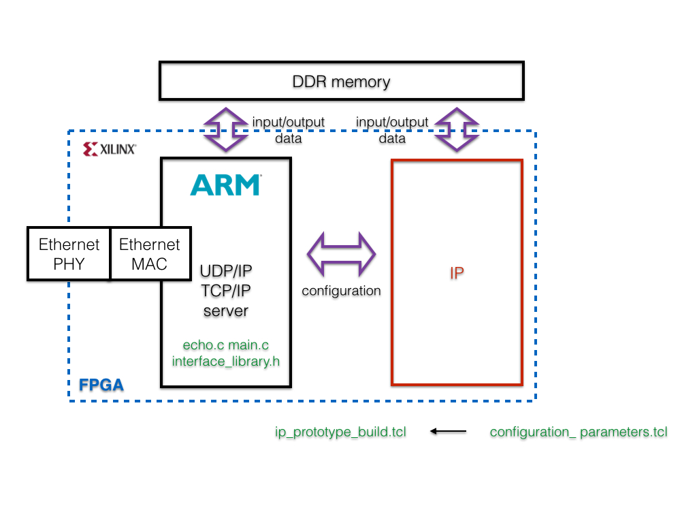

#ICL SDK4FPGA

Copyright (C) 2014 by Andrea Suardi <a.suardi@imperial.ac.uk> , Imperial College London.  
Supported by the EPSRC Impact Acceleration grant number EP/K503733/1 

---

### Why it ?

* ICL SDK4FPGA **enables** researchers and engineers (**with or without FPGA knowhow**) to **build, validate and prototype** their mathematical algorithms into an **FPGA** based system.
* Users need **only** to **code** their **algorithm** using **C/C++**
* **Abstracts low level** FPGA **details** from the users: build a testbench, access data to external FPGA memory, ...
* Gives **full control (NOT a black box)** of all FPGA project phases (test, build, prototype)

---
### Ecosystem

ICL SDK4FPGA is open source under [GNU Lesser General Public License v3](LICENSE) consisted of:

* **Framework:** TCL scripts and design templates (C/C++ and Matlab code) that support the users in all the project phases.
* **Plugins:** advance features that support the user to create an optimal FPGA design. As example, it would be nice to support FPGA design space exploration, word length optimization, ...
* **Example designs:** users application designs built using ICL SDK4FPGA framework. 

---

### What do I need to set up an algorithm running in FPGA ?

##### Expertise

Usually, the user effort for developing an algorithm on FPGA is focused mainly on the understanding about FPGA architecture and on learning about HDL languages coding (such as VHDL or Verilog). This know-how has been a specific domain of FPGA geeks for many years and it has been the main entrance barrier to the adoption of FPGA.  
However during the last years, High Level Synthesis tools enhancement has closed the gap between FPGA programming requirements and users know-how by means of an efficient C/C++ FPGA programming approach. ICL SDK4FPGA, adopting this recent FPGA programming style with an assisted design methodology base on scripts, aims to speared the FPGA use welcoming users at any levels, who has heard about FPGA but has never used it as well as FPGA geeks.

To give an idea about the effort required designing algorithms on an FPGA, the charts here below give some numbers based on my personal experience as FPGA designer:

##### Software

ICL SDK4FPGA is a C/C++ based framework targeting [Xilinx FPGA](www.xilinx.com) as a starting point. many improvement directions can be taken, such as support OpenCL language as well as other vendors like [Altera FPGA](www.altera.com).  
The required software is:

* [Vivado Design Suite](http://www.xilinx.com/products/design-tools/vivado/index.htm) 2014.1 with Vivado High-Level Synthesis (a free 30-day Evaluation is available from [Xilinx](http://www.xilinx.com/support/download.html) website)  
* [MathWorks Matlab](http://www.mathworks.co.uk/products/matlab/) 2014a. It has not been tested with previous releases, but I should work. 

##### Hardware

ICL SDK4FPGA supports all Xilinx 7 Series and Zynq®-7000 FPGA devices. Support also older architectures, but refer to [Xilinx](http://www.xilinx.com/products/design-tools/vivado/integration/esl-design/) website for a complete list. If the design purpose is to prototype the designed IP with an Evaluation Board, only these here below are supported now (we are committed to expand this set):

* [ZedBoard](http://www.zedboard.org/product/zedboard)  Zynq™-7000 Development Board  with  Zynq XC7Z020   
* [MicroZed](http://www.zedboard.org/product/microzed) System-On-Module with  Zynq XC7Z020   
* Xilinx Zynq-7000 All Programmable SoC [ZC706](http://www.xilinx.com/products/boards-and-kits/EK-Z7-ZC706-G.htm) Evaluation Kit with Zynq XC7Z045   
* Xilinx Zynq-7000 All Programmable SoC [ZC702](http://www.xilinx.com/products/boards-and-kits/EK-Z7-ZC702-G.htm) Evaluation Kit with Zynq XC7Z020 

---

### How does it work ?

ICL SDK4FPGA has been designed to be intuitive and to guide the user during all the design phases:  
  
1. [Define design specifications](#header:setconf) (*configuration\_parameters.tcl*)
2. [Make a custom template](#header:maketemplate) (*make_template.tcl*)
3. Starting from the template, [code your algorithm](#header:alg) using C/C++ language (*IP design: source code*)
4. [Test the algorithm code](#header:IPdesigntest) (*IP design: test C/RTL simulation*)
5. [Build the algorithm code](#header:IPdesignbuild) (*IP design: build*)
6. [Build the FPGA circuit](#header:IPprototypebuild) (*IP prototype: build*)
7. [Test the FPGA circuit](#header:IPprototypetesthil) (*IP prototype: test Hardware In the Loop*)

---

###  Design specifications

Edit *configuration\_parameters.tcl* file to set up design parameters. It allows to configure: 
 
* Algorithm **input and output vectors**
* Project name  
* Data representation (floating-point single precision or any fixed-point up to 32 bits word length)  
* FPGA circuit clock frequency  
* Target FPGA device  
* Traget Evaluation Board on which prototype the designed IP  
* Number of time to repeat tests to exhaustively validate the designed algorithm  
* RTL simulator (supports Mentor Graphics Modelsim or Xilinx xsim)  
* Hardware in The Loop interface (Ethernet UDP/IP or TCP/IP)
* Matlab software path
 
**NOTES:** all the parameters can also be edited during all the design phases except for algorithm input and output vectors. These parameters, namely **input\_vectors, output\_vectors, max\_vector\_length**, can be edited only before [make template](#header:maketemplate). 

---

###  Make template

To build the template project: 
 
1. run Vivado HLS Command Prompt  
2. type: *vivado\_hls -f make_template.tcl*

---

###  Algorithm coding

Users can code their algorithm editing the *IP\_design/src/foo\_user.cpp* file using C/C++ language.  Please **do not edit the function header**.

As algorithm is intended a mathematical or logical function that:

1.  receives input data **(input\_vectors)**, namely in the form of vectors of all of the same size **(max\_vector\_length)**.
2.  performs computation using the input data.
3.  returns the results data **(output\_vectors)**, namely in the form of vectors of all of the same size **(max\_vector\_length)**.

From a programming point of view, the code algorithm (*IP\_design/src/foo\_user.cpp*) is a sub function of top layer function, namely foo function (*IP\_design/src/foo.cpp*).  
The foo function, which is **recommend to not edit**,  handles: 

* data transfer between the FPGA external DDR memory and the algorithm code via an AXI-master interface.
* configuration data exchange with an embedded CPU into the FPGA via an AXI-slave interface.

**NOTE:** the proposed FPGA circuit architecture:  

* guarantees a data high bandwidth between user algorithm and DDR memory.
* unloads the CPU from transferring directly data to the user algorithm (very low bandwidth available) and makes the CPU free to execute any other software functions.
* is the base line circuit architecture for building an heterogeneous system where the user algorithm is split between CPU and IP.

  

---

###  IP design: test

ICL SDK4FPGA framework allows the users to verify the numerical and behavioural correctness of  their coded algorithm abstracting many low level FPGA verification details. The users can generate stimulus for their algorithm and analyse the simulation results using Matlab software, respectively editing functions *ip\_design/src/write_stimulus.m* and *ip\_design/src/read\_results.m*.

Two types of simulation are supported:

##### c-simulation

Vivado HLS software automatically builds a bit accurate c-model of the user algorithm. Therefore running a c-simulaiton is possible to verify correctness of the coded algorithm form a numeric point of view.

To run a c-simulation: 
 
1. run Vivado HLS Command Prompt  
2. type: *vivado_hls -f ip\_design\_test\_csim.tcl*  
3. simulation results are logged into *ip\_design/test\_csim/results* folder

##### RTL-simulation

Vivado HLS software automatically builds an RTL circuit representing the user algorithm. Therefore running a RTL-simulaiton is possible to verify correctness of the coded algorithm form both a numeric and signals synchronization point of view.

To run a RTL-simulation:  

1. run Vivado HLS Command Prompt  
2. type: *vivado_hls -f ip\_design\_test\_rtlsim.tcl*  
3. simulation results are logged into *ip\_design/test\_rtlsim/results* folder

---

###  IP design: build

When the test phase based on c/RTL simulation has been completed, the users have to build the circuit representing their mathematical algorithm.  
Vivado HLS software automatically compiles the user algorithm (coded in C/C++) and output an RTL circuit representation that is exported as an Xilinx standard IP. This allows also the users to integrate their own IPs into more complex FPGA project.

To build the IP design:  

1. Run Vivado HLS Command Prompt
2. type: *vivado_hls -f ip\_design\_build.tcl*
3. Implementation report including algorithm execution time (expressed in clock cycles) and silicon resources is available *ip\_design/build/reports* folder

---

###  IP prototype: build

Once the IP has been built, the users can prototype it on an Evaluation Board and etst it via an Hardware In the Loop (HIL) setup. To do so, the FPGA has to be programmed with a configuration file named *bitstream*.

 
To build the IP prototype *bitstream*:  

1. Run Vivado TCL shell
2. type: *vivado -mode tcl -source ip_prototype_build.tcl*  **note: this phase can take several minutes depending on the complexity of the algorithm**
3. Implementation reports including algorithm execution time (expressed in clock cycles), silicon resources and power consumption estimation are available *ip\_prototype/build/reports* folder
4. When Vivado software has finished to build the FPGA configuration file, a light software application has to be built and run on the FPGA embedded CPU (ARM cortex A9) in order to handle the data communication between the FPGA and an external host. To build this software application the following manual steps have to be performed (**at the moment is not available any scripts that automates them. We look forward for developing one**) :
    1. Xilinx SDK gui will open on the screen and the just built FPGA *bitstream* is automatically loaded into the SDK project created into *ip\_prototype/build/prj/project\_name.board\_name/prototype.sdk/SDK/SDK_export* folder.  
    2. Four spaces again.

---

###  IP prototype: test HIL

The last project phase consist to 

