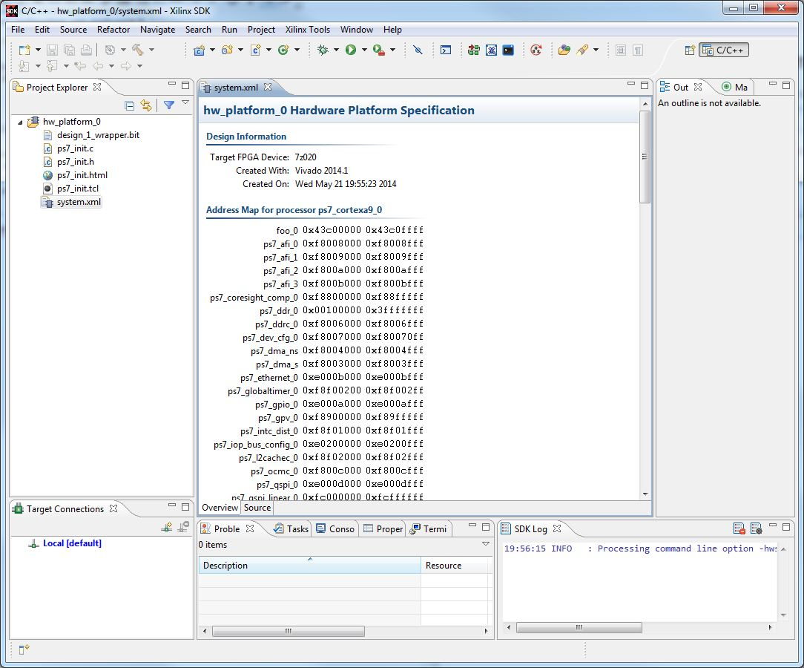
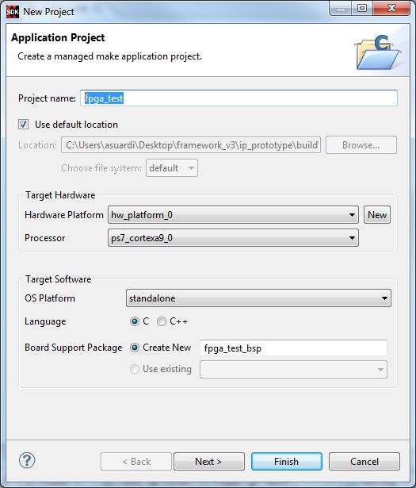
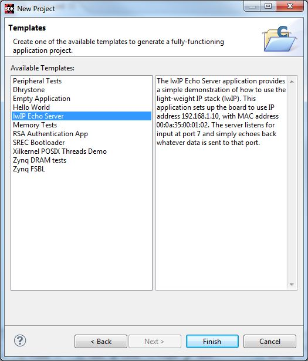
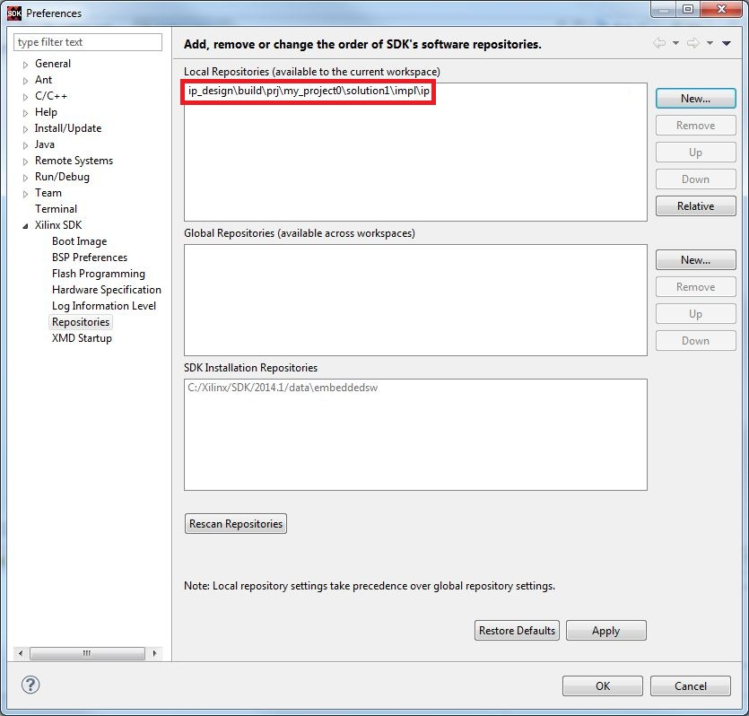
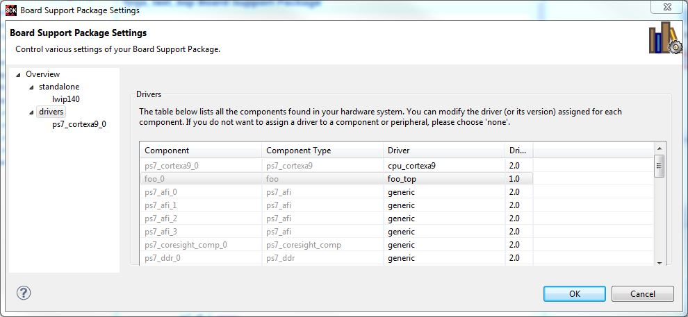
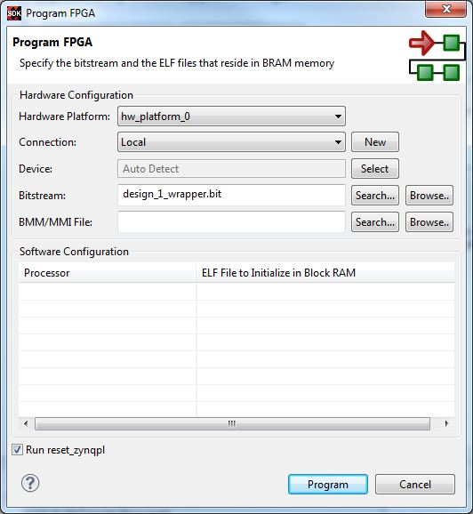
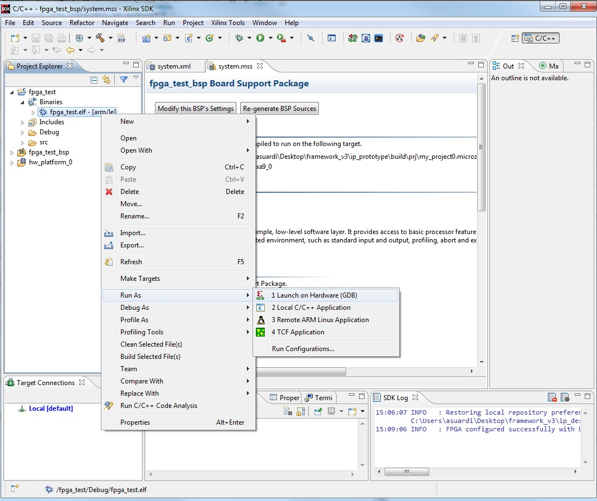
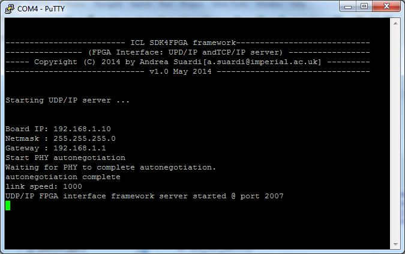

#ICL SDK4FPGA Ethernet server configuration user guide

Copyright (C) 2014 by Andrea Suardi <a.suardi@imperial.ac.uk> , Imperial College London.  
Supported by the EPSRC Impact Acceleration grant number EP/K503733/1 

---

To build the software application running on the microprocessor the following steps has to be done:

1. Once Vivado Design Suite has completed the project building on design phase 5, automatically Xilinx SDK GUI will pop up on the screen.
2. A new SDK project will be created into the *ip\_prototype/build/prj/project\_name.board\_name/prototype.sdk/SDK/SDK_export* folder. Where `project_name` and `board_name` are the configuration parameter defined in *configuration\_parameters.tcl* file.

	  
	

	
	

	  

3. In SDK, choose "File" -> "New" -> "Application Project", assign a project name (as example, lets call it "fpga_test") and click the "Next" button.
 
	  
	

	
	

	  

4. Select the *lwIP Echo Server* example design and click "Finish" button. The selected software application example project will created.
 
	  
	

	
	

	  

5. Update the example design with the ones provided by ICL SDK4FPGA framework template: copy *echo.c*, *main.c* and *interface_library.h* from *ip\_prototype/src* folder into the project *ip\_prototype/build/prj/project\_name.board\_name/prototype.sdk/SDK/SDK_export\fpga\_test\src* folder replacing those automatically generated by the Xilinx SDK.

6. In SDK select "Xilinx Tools" -> "Repositories" and add the built IP drivers path *ip\_design\build\prj\project\_name\solution1\impl\ip* to
the local driver repository search path

	  
	

	
	

	  

	where *my_project0* is the `project_name` configuration parameters.

7. In SDk select "Xilinx Tools" -> "Board Support Package Settings" -> "fpga\_test\_bsp".
Check that drivers for “foo\_0” is "foo_top" and not "generic"

	  
	

	
	

	  

8. The SDK project should now build without errors: in SDK select "Project" -> "Clean" -> "OK" to make a clean build of the software application.

9. Connect the Evaluation Board to your host system. Please refer to the Evaluation Board vendor user guide for setting up the requested connections: a USB JTAG programming cable for programming the FPGA and UART-USB cable for connecting to a serial terminal.

10.  In SDK select "Xilinx Tools" -> "Program FPGA" -> "Program" to program FPGA configuration file, named *bitstream*.

	  
	

	
	

	  

11. Open a serial terminal with the following settings: baud Rate to 115200, parity to None and data Bits to 8.

12. Start the software application running on the microprocessor: right click on the microprocessor configuration file, output of clean build (step 8) and select "Launch on Hardware"

	  
	

	
	

	  

	The following messages will be shown on the console if UDP/IP server configuration has been selected.

	  
	

	
	

	  

13. The FPGA is now configured correctly. Please refer for design phase 7 in [README](../README.md) to run HIL tests.
