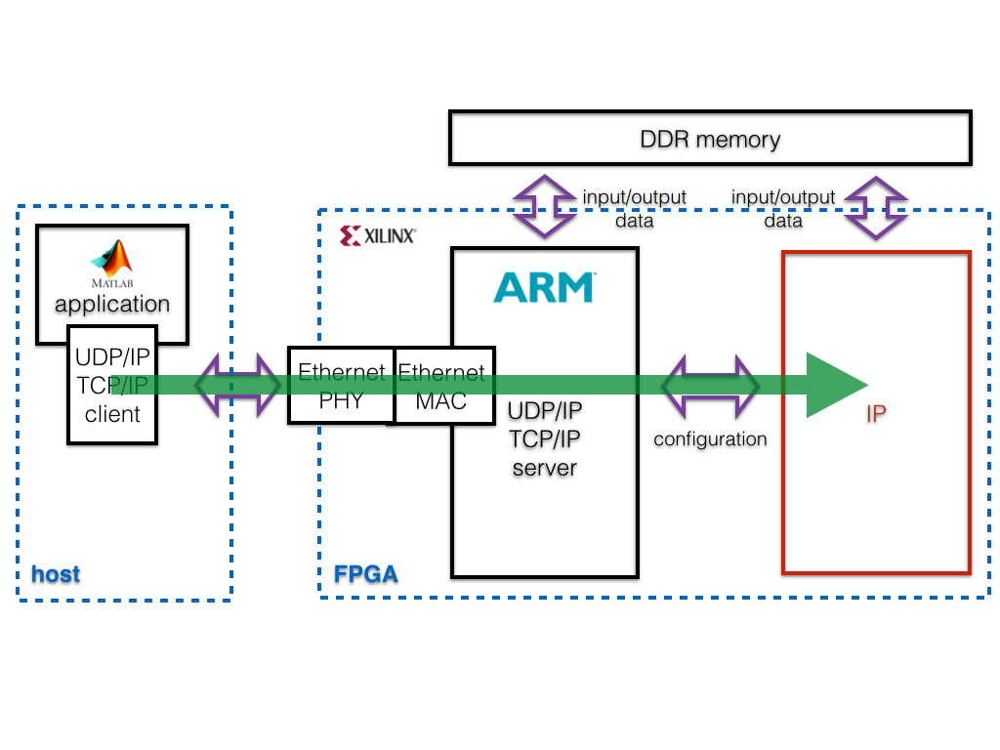
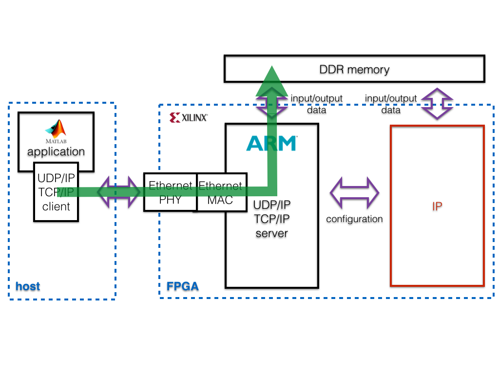
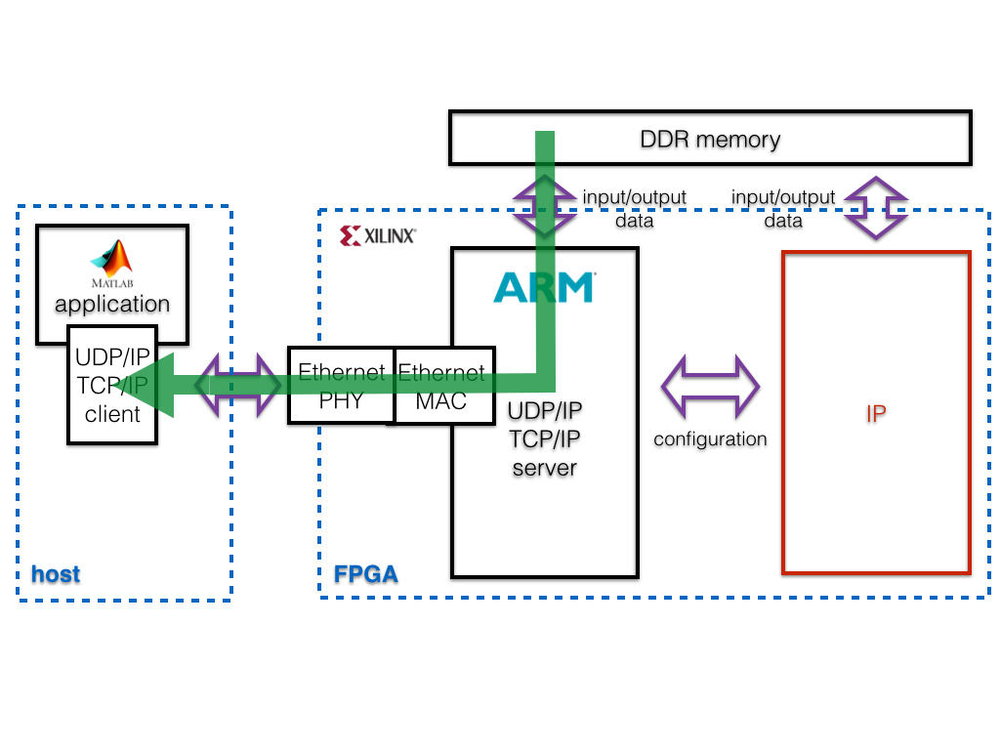

#ICL SDK4FPGA

Copyright (C) 2014 by Andrea Suardi <a.suardi@imperial.ac.uk> , Imperial College London.  
Supported by the EPSRC Impact Acceleration grant number EP/K503733/1 

---

### How does it work ?

ICL SDK4FPGA has been designed to be intuitive and to guide the user during all the design phases:  
  
1. Define design specifications (*configuration\_parameters.tcl*)
2. Make a custom template (*make_template.tcl*)
3. Starting from the template, code the algorithm using C/C++ language (*IP design: source code*)
4. Test the algorithm code (*IP design: test c/RTL simulation*)
5. Build the algorithm code (*IP design: build*)
6. Build the algorithm on an FPGA (*IP prototype: build*)
7. Test the algorithm running on an FPGA (*IP prototype: test Hardware In the Loop*)

---

### 1. Design specifications

Edit *configuration\_parameters.tcl* file to set up design parameters. It allows to configure: 
 
* Algorithm **input and output vectors**
* Project name  
* Data representation (floating-point single precision or any fixed-point up to 32 bits word length)  
* FPGA circuit clock frequency  
* Target FPGA device  
* Traget Evaluation Board on which prototype the designed IP  
* Number of time to repeat tests to exhaustively validate the designed algorithm  
* RTL simulator (supports Mentor Graphics Modelsim or Xilinx xsim)  
* Hardware in The Loop interface (Ethernet UDP/IP or TCP/IP)
* Matlab software path
 
A detailed description of the above parameter is available in the *configuration\_parameters.tcl* file itself.  
The same design specifications are shared among all the design phases (namely steps 2,4,5,6,7).
However, each design design phase allows to use only some of them. 

---

### 2. Make template

##### Design phase 2 parameters:

    input_vectors  
	output_vectors  
	max_vector_length
	float_fix
	bits_word_integer_length
	bits_word_fraction_length

**NOTE 1:** because `input_vectors, output_vectors, max_vector_length` parameters can be **edited only in this phase**, it is important to have defined the input and the outputs of the algorithm.
 
**NOTE 2:** `float_fix, bits_word_integer_length, bits_word_fraction_length` can be edited also during the following design phases.

To build a project template customized according the input and output vectors specification: 
 
1. run Vivado HLS Command Prompt  
2. type: *vivado\_hls -f make_template.tcl*

---

### 3. Algorithm coding

Users can code their algorithm editing the *IP\_design/src/foo\_user.cpp* file using C/C++ language.  An header file, *IP\_design/src/foo\_user\_data.h*, is used to declare the include libraries, the size `N=max_vector_length` of the input and output vectors, and the data type definitions.  
Please **do not edit the `foo_user` function declaration:**

	void foo_user(  data_t ...[N],
					data_t ...[N],
					data_t ...[N])

where `...` are the input and output vector names declared respectively in the `(input_vectors)` and `(output_vectors)` configuration parameters.

Algorithm is intended a mathematical or logical function that:

1.  receives input data `(input_vectors)`, namely in the form of vectors of all of the same size `(max_vector_length)`.
2.  performs computation using the input data.
3.  returns the results data `(output_vectors)`, namely in the form of vectors of all of the same size `(max_vector_length)`.

From a programming point of view, the algorithm code (*IP\_design/src/foo\_user.cpp*) is a sub function called by a top layer function, named `foo` (*IP\_design/src/foo.cpp*).  
The `foo` function, which is **recommend to not edit**,  handles: 

* data transfer between the FPGA external shared DDR memory and the algorithm code via an AXI-master interface.
* configuration data exchange with an embedded CPU into the FPGA via an AXI-slave interface.

##### Circuit architecture REMARKS

The proposed architecture guarantee:

* guarantees a data high bandwidth between user algorithm and shared DDR memory.
* unloads the CPU from transferring data directly to/from the user algorithm (very low bandwidth available) and makes the CPU free to execute any other software functions.
* is the base line circuit architecture for building an heterogeneous system where the user algorithm is split between CPU and IP.

  

---

### 4. IP design: test

##### Design phase 4 parameters:

	project_name	
	float_fix
	bits_word_integer_length
	bits_word_fraction_length
	fclk
	FPGA_name
	num_simulation
	rtl_simulator
	MatlabPath

ICL SDK4FPGA framework allows the users to verify the numerical and behavioural correctness of  their coded algorithm abstracting many low level FPGA verification details. The users can generate stimulus for their algorithm and analyse the simulation results using Matlab software, respectively editing functions *ip\_design/src/write_stimulus.m* and *ip\_design/src/read\_results.m* files code.

Two types of simulation are supported:

##### c-simulation

Vivado HLS software automatically builds a bit accurate c-model of the user algorithm. Therefore running a c-simulaiton is possible to verify correctness of the coded algorithm form a numeric point of view.

To run a c-simulation: 
 
1. run Vivado HLS Command Prompt  
2. type: *vivado_hls -f ip\_design\_test\_csim.tcl*  
3. test results are logged into *ip\_design/test\_csim/results* folder

**NOTE:** all the simulation steps can be repeated automatically setting the `num_simulation` configuration parameter.

##### RTL-simulation

Vivado HLS software automatically builds an RTL circuit representing the user algorithm. Therefore running a RTL-simulaiton is possible to verify correctness of the coded algorithm form both a numeric and digital signals point of view.

To run a RTL-simulation:  

1. run Vivado HLS Command Prompt  
2. type: *vivado_hls -f ip\_design\_test\_rtlsim.tcl*  
3. test results are logged into *ip\_design/test\_rtlsim/results* folder

**NOTE 1:** RTL-simulation can take very long time depending on the complexity of the coded algorithm

**NOTE 2:** ICL SDK4FPGA framework supports two RTL simulators:  

* **xsim** simulator is a software package part of the Vivado Design Suite. To visualize the circuit signals waveform:
	* Run Vivado TCL shell
	* type: *view_rtlsim_waveform.tcl*

* **modesim**  simulator. To visualize the circuit signals waveform:
	* Run modelsim GUI
	* Open file waveform dump file: *ip\_design/test\_rtlsim/results/foo.wlf*
	* Type *add wave \** in the console

---

### 5. IP design: build

##### Design phase 5 parameters:

	project_name	
	float_fix
	bits_word_integer_length
	bits_word_fraction_length
	fclk
	FPGA_name

**NOTE:** all these parameters **can not be changed** during the following design phases (steps 6,7)

When the test phase based on c/RTL simulation has been completed, the users have to build the circuit representing their mathematical algorithm, thus convert the C/C++ code into an RTL circuit description. Vivado HLS software is the tool involved in this design phase.  
It also package the `foo` function, thus the user algorithm into a **Xilinx IP** with a standard bus interface (AXI). This means that the generate IP can be easily integrate into more complex FPGA based systems.

To build the IP design:  

1. Run Vivado HLS Command Prompt
2. type: *vivado_hls -f ip\_design\_build.tcl*
3. Implementation report including algorithm execution time (expressed in clock cycles) and silicon resources is available *ip\_design/build/reports* folder
4. Built IP is available into the *ip\_design/build* folder

---

### 6. IP prototype: build

Once the IP has been built, the users can deploy it on a supported Evaluation Board and test it via an Hardware In the Loop (HIL) setup. Before to give a detail description of this design phase steps, the prototyping setup is presented.

The prototyping setup is composed of two main parts:

* an FPGA on which is running a microprocessor (ARM based) and the user algorithm tested and built during phases 3,4,5. It should be noticed that the user algorithm, even if it is coded using C/C++ language, is not running on the microprocessor, but is an ad hoc physical circuit mapped into the FPGA logic.
* a host system is a Matlab based application which allow the users to generate the stimulus data and to analyse the FPGA processed data.

The host system and the FPGA communicate via Ethernet interface by means of UDP/IP or TCP/IP packets. On the FPGA side, the microprocessor runs a *baremetal* software application (the application same code can be integrated with an OS based application). It is a lwIP UDP/IP or TCP/IP server that bridges the communication between the physical Ethernet interface, the DDR memory and the designed IP. On the other hand, the host runs a UDP/IP or TCP/IP client accessible from Matlab. 
 

##### Design phase 6 parameters:

	board_name
	tcp_udp

 

To build the prototyping setup, the FPGA configuration file, named *bitstream*, as well the software application running on the microprocessor have to be built: 

1. Run Vivado TCL shell
2. type: *vivado -mode tcl -source ip\_prototype\_build.tcl*  to build the FPGA configuration file
**NOTE: this phase can take several minutes depending on the complexity of the algorithm**
3. Implementation reports including algorithm execution time (expressed in clock cycles), silicon resources and power consumption estimation are available *ip\_prototype/build/reports* folder
4. When Vivado Design Suite software has completed the building process, the software application running on the microprocessor has to be built as well. However, building the latter application requires a few manual steps. **At the moment is not available any scripts that automates them. It would be nice to have one.** Please refer to [ICL SDK4FPGA Ethernet server configuration user guide](SDK4FPGA_ethernet_server_configuration_user_guide.md) for a detailed description.

---

### 7. IP prototype: test HIL

Once the FPGA has been correctly configured, the users can run HIL tests.
They can take full control of the designed IP directly from Matlab via a function, named `FPGAclientMATLAB`, provided within ICL SDK4FPGA framework. The source code of this function is available in *ip\_prototype/src/FPGAclientMATLAB.c* file.

##### `FPGAclientMATLAB` function declaration

	FPGAclientMATLAB(data_to_send,packet_type,packet_internal_ID,packet_output_size);

where:

* `packet_type` defines the packet type. It supports:
	*  `packet_type=1` IP reset
	*  `packet_type=2` IP start computation
	*  `packet_type=3` Send input vector to the IP
	*  `packet_type=4` Receive output vector form the IP
* `data_to_send` is the user algorithm input data vector
* `packet_internal_ID`is the input and output vector unique identifier. As example, let suppose the input vectors are "x0" "x1", thus `packet_internal_ID=0` for vector "x0" and `packet_internal_ID=1` for vector "x1". On the other hand, if the output vector is "y0", the associated identifier is  `packet_internal_ID=0`.
* `packet_output_size` identify the number of data to receive form the IP. It is the size of the output vector.

**NOTE 1:** to use the above function all the parameter has to be passed.

**NOTE 2: do not modify the vector unique identifier assigned to the input and output vectors.**

##### `FPGAclientMATLAB` function use

To control the designed IP, `FPGAclientMATLAB` has to be called with the following order: 

1. **IP reset**
	* `packet_type=1`
	* remaining parameters can have any values
	
	The IP variables are reset to their initial values.

	

	
	

2. **Send input vectors to the IP**

	This step has to be repeated for each input vector to be sent to the IP

	* `packet_type=3`
	* `data_to_send` is input vector data 
	* `packet_internal_ID` is the input vector unique identifier
	* remaining parameters can have any values

	The input vector is written to the DDR memory to a specific location. Please refer to *ip\_prototype\doc\readme.md* for details on how the vectors are stored in the DDR memory.

	

	
	

3. **IP start computation**

	* `packet_type=2`
	* remaining parameters can have any values.

	The microprocessor on the FPGA send configuration settings to the IP (location of the input and output vectors in the DDR memory) and kick off the algorithm execution.

	

	
	

	Once the microprocessor on the FPGA has started the IP, the IP:

	1. fetches the input data vectors from the DDR memory 
	2. performs the computations
	3. write the results (output vectors)  to the DDR memory
	4. informs the microprocessor that it has finished  

	

	
	

4. **Receive output vector form the IP**

	This step has to be repeated for each output vector to be sent to the IP

	* `packet_type=4`
	* `packet_internal_ID` is the output vector unique identifier
	* `packet_output_size` is the number of data for current output vector
	* remaining parameters can have any values

	The output vector is read by the Matlab application from a specific location in the DDR memory. Please refer to *ip\_prototype\doc\readme.md* for details on how the vectors are stored in the DDR memory.

	

	
	

##### Run HIL test

An example Matlab application about the use of the function is available with the Matlab script *ip\_prototype/src/HIL\_test.m*.

To run the HIL test the following steps have to be done: 

1. Run Matlab
2. Set the working directory *ip\_prototype/src* 
3. Compile the `FPGAclientMATLAB` function. Type: *mex FPGAclientMATLAB.c* Note that a C/C++ compiler has to be installed.
2. Run *ip\_prototype/src/HIL\_test.m* script.
3. test results are logged into *ip\_prototype/test\_HIL/results* folder

**NOTE:** all the simulation steps can be repeated automatically editing the `num_simulation` variable declared in ip\_prototype/src/HIL\_test.m* Matlab script.

